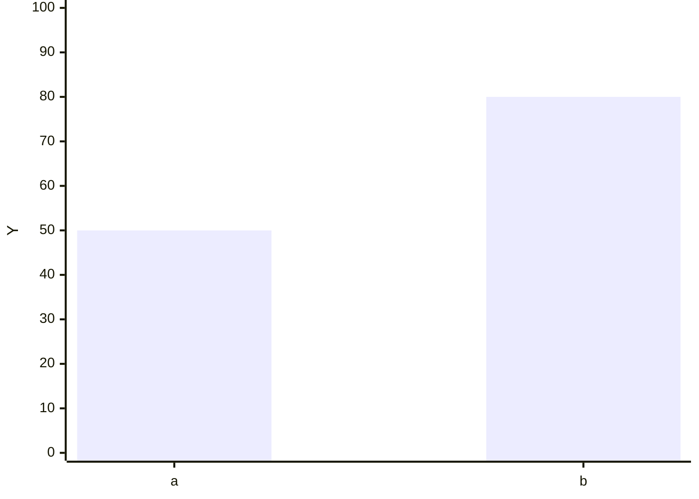
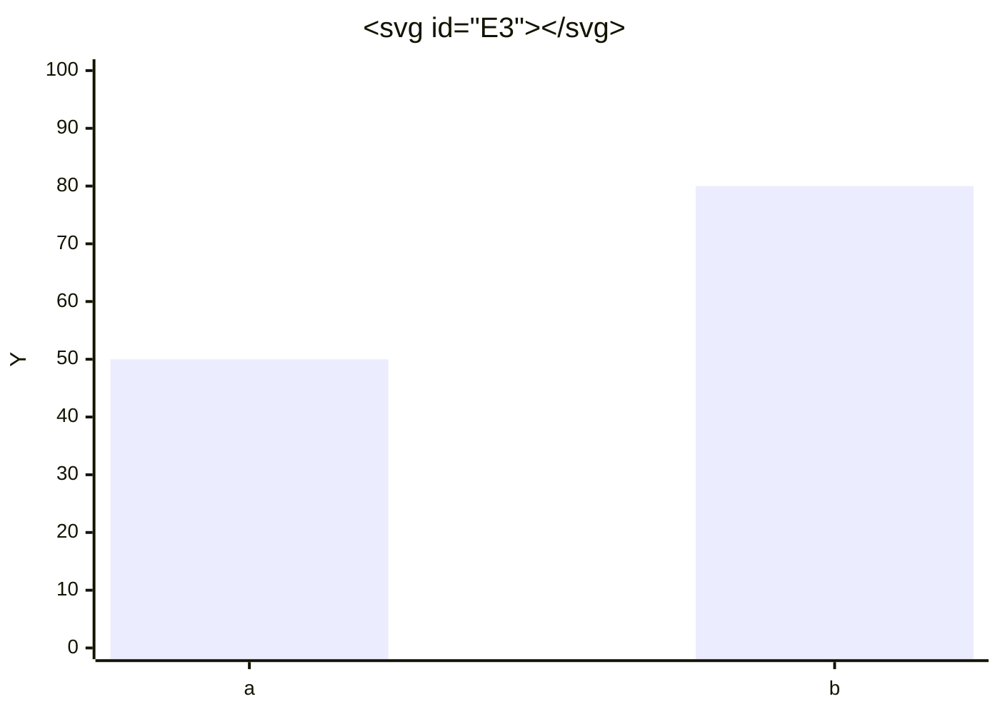
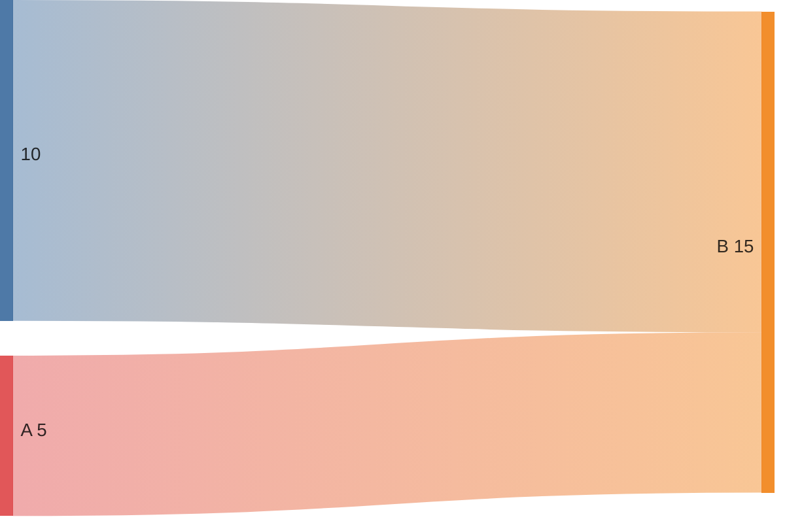
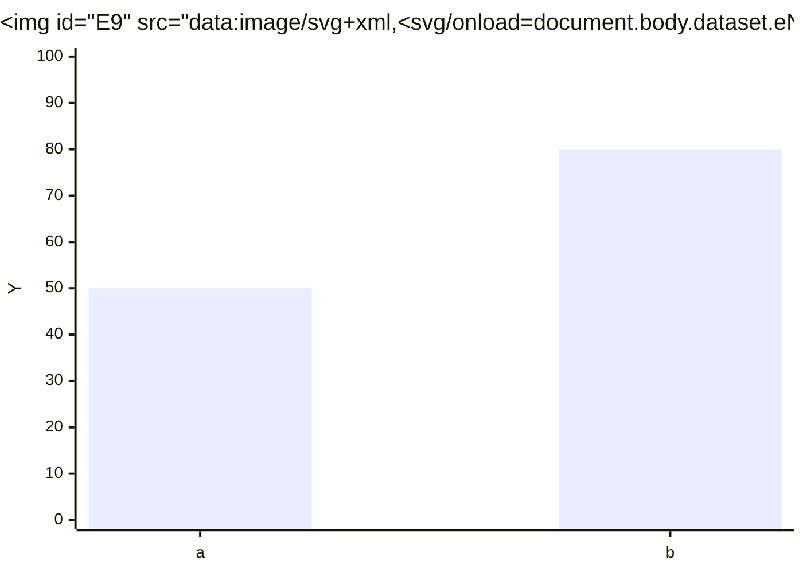
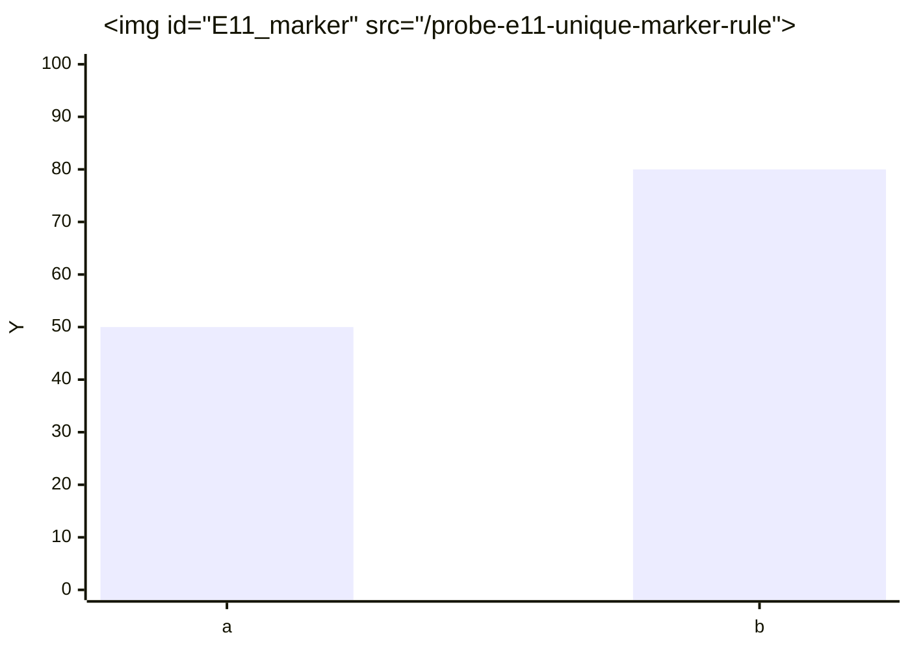

# Mermaid Escalation Probes

## E1: xychart with iframe srcdoc

## E2: xychart with direct script tag

## E3: xychart with svg+script tag

## E4: xychart with meta refresh

## E5: xychart with style behavior

## E6: xychart with svg use href

## E7: sankey with object data

## E8: c4 with link rel import

## E9: xychart with data uri image with onload

## E10: gantt with form action

```mermaid
gantt
    title <form id=E10 action='javascript:document.body.dataset.eTen=1'><input autofocus></form>
    section A
    t1 :a1, 2020-01-01, 30d
```

## E11: Test unique-marker image src with cache-bust  

